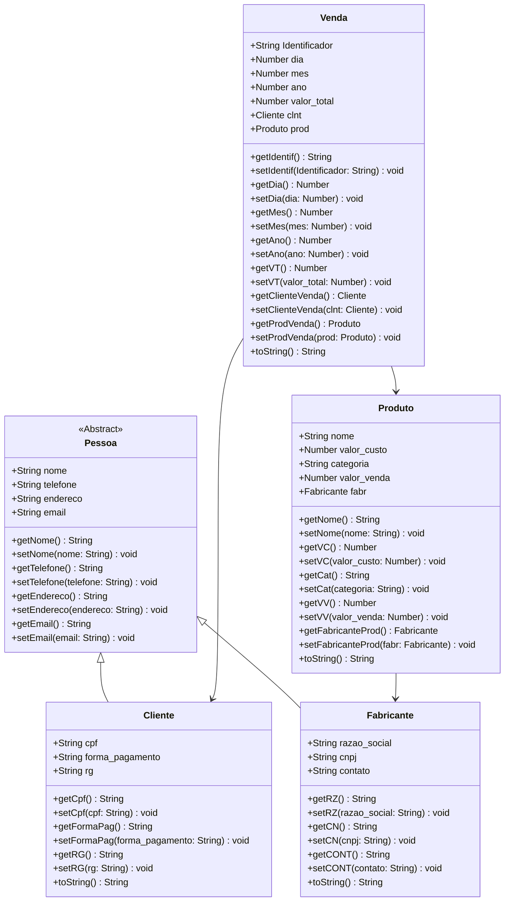

```mermaid
classDiagram
    class Pessoa {
        <<Abstract>>
        +String nome
        +String telefone
        +String endereco
        +String email
        +getNome() String
        +setNome(nome: String) void
        +getTelefone() String
        +setTelefone(telefone: String) void
        +getEndereco() String
        +setEndereco(endereco: String) void
        +getEmail() String
        +setEmail(email: String) void
    }

    class Cliente {
        +String cpf
        +String forma_pagamento
        +String rg
        +getCpf() String
        +setCpf(cpf: String) void
        +getFormaPag() String
        +setFormaPag(forma_pagamento: String) void
        +getRG() String
        +setRG(rg: String) void
        +toString() String
    }

    class Fabricante {
        +String razao_social
        +String cnpj
        +String contato
        +getRZ() String
        +setRZ(razao_social: String) void
        +getCN() String
        +setCN(cnpj: String) void
        +getCONT() String
        +setCONT(contato: String) void
        +toString() String
    }

    class Produto {
        +String nome
        +Number valor_custo
        +String categoria
        +Number valor_venda
        +Fabricante fabr
        +getNome() String
        +setNome(nome: String) void
        +getVC() Number
        +setVC(valor_custo: Number) void
        +getCat() String
        +setCat(categoria: String) void
        +getVV() Number
        +setVV(valor_venda: Number) void
        +getFabricanteProd() Fabricante
        +setFabricanteProd(fabr: Fabricante) void
        +toString() String
    }

    class Venda {
        +String Identificador
        +Number dia
        +Number mes
        +Number ano
        +Number valor_total
        +Cliente clnt
        +Produto prod
        +getIdentif() String
        +setIdentif(Identificador: String) void
        +getDia() Number
        +setDia(dia: Number) void
        +getMes() Number
        +setMes(mes: Number) void
        +getAno() Number
        +setAno(ano: Number) void
        +getVT() Number
        +setVT(valor_total: Number) void
        +getClienteVenda() Cliente
        +setClienteVenda(clnt: Cliente) void
        +getProdVenda() Produto
        +setProdVenda(prod: Produto) void
        +toString() String
    }

    Pessoa <|-- Cliente
    Pessoa <|-- Fabricante
    Produto --> Fabricante
    Venda --> Cliente
    Venda --> Produto
```
